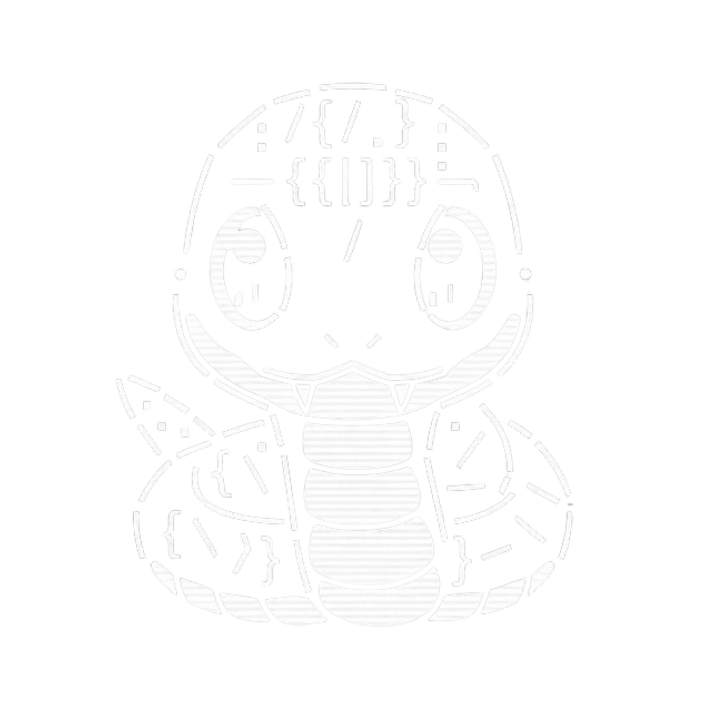
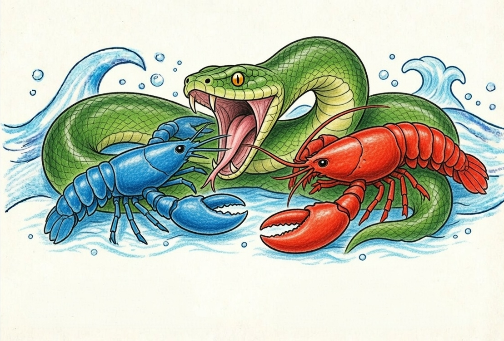

<p align="center">
  
</p>

<h1 align="center">OpenFang</h1>
<h3 align="center">The Agent Operating System</h3>

<p align="center">
  Open-source Agent OS built in Rust. 137K LOC. 14 crates. 1,767+ tests. Zero clippy warnings.<br/>
  <strong>One binary. Production-grade. Agents that actually work for you.</strong>
</p>

<p align="center">
  <a href="https://openfang.sh/docs">Documentation</a> &bull;
  <a href="https://openfang.sh/docs/getting-started">Quick Start</a> &bull;
  <a href="https://discord.gg/openfang">Discord</a> &bull;
  <a href="https://x.com/openfang_ai">Twitter</a>
</p>

<p align="center">
  
  
  
  
  
</p>

---

> **v0.1.0 — First Release (February 2026)**
>
> OpenFang is feature-complete but this is the first public release. You may encounter instability, rough edges, or breaking changes between minor versions. We ship fast and fix fast. Pin to a specific commit for production use until v1.0. [Report issues here.](https://github.com/RightNow-AI/openfang/issues)

---

## What is OpenFang?

OpenFang is a **production-grade Agent Operating System** — not a chatbot framework, not a Python wrapper around an LLM, not a "multi-agent orchestrator." It is a full operating system for autonomous agents, built from scratch in Rust.

Traditional agent frameworks wait for you to type something. OpenFang runs **autonomous agents that work for you** — on schedules, 24/7, building knowledge graphs, monitoring targets, generating leads, managing your social media, and reporting results to your dashboard.

The entire system compiles to a **single ~32MB binary**. One install, one command, your agents are live.

```bash
curl -fsSL https://openfang.sh/install | sh
openfang init
openfang start
# Dashboard live at http://localhost:4200
```

<details>
<summary><strong>Windows</strong></summary>

```powershell
irm https://openfang.sh/install.ps1 | iex
openfang init
openfang start
```

</details>

---

## Hands: Agents That Actually Do Things

<p align="center"><em>"Traditional agents wait for you to type. Hands work <strong>for</strong> you."</em></p>

**Hands** are OpenFang's core innovation — pre-built autonomous capability packages that run independently, on schedules, without you having to prompt them. This is not a chatbot. This is an agent that wakes up at 6 AM, researches your competitors, builds a knowledge graph, scores the findings, and delivers a report to your Telegram before you've had coffee.

Each Hand bundles:
- **HAND.toml** — Manifest declaring tools, settings, requirements, and dashboard metrics
- **System Prompt** — Multi-phase operational playbook (not a one-liner — these are 500+ word expert procedures)
- **SKILL.md** — Domain expertise reference injected into context at runtime
- **Guardrails** — Approval gates for sensitive actions (e.g. Browser Hand requires approval before any purchase)

All compiled into the binary. No downloading, no pip install, no Docker pull.

### The 7 Bundled Hands

| Hand | What It Actually Does |
|------|----------------------|
| **Clip** | Takes a YouTube URL, downloads it, identifies the best moments, cuts them into vertical shorts with captions and thumbnails, optionally adds AI voice-over, and publishes to Telegram and WhatsApp. 8-phase pipeline. FFmpeg + yt-dlp + 5 STT backends. |
| **Lead** | Runs daily. Discovers prospects matching your ICP, enriches them with web research, scores 0-100, deduplicates against your existing database, and delivers qualified leads in CSV/JSON/Markdown. Builds ICP profiles over time. |
| **Collector** | OSINT-grade intelligence. You give it a target (company, person, topic). It monitors continuously — change detection, sentiment tracking, knowledge graph construction, and critical alerts when something important shifts. |
| **Predictor** | Superforecasting engine. Collects signals from multiple sources, builds calibrated reasoning chains, makes predictions with confidence intervals, and tracks its own accuracy using Brier scores. Has a contrarian mode that deliberately argues against consensus. |
| **Researcher** | Deep autonomous researcher. Cross-references multiple sources, evaluates credibility using CRAAP criteria (Currency, Relevance, Authority, Accuracy, Purpose), generates cited reports with APA formatting, supports multiple languages. |
| **Twitter** | Autonomous Twitter/X account manager. Creates content in 7 rotating formats, schedules posts for optimal engagement, responds to mentions, tracks performance metrics. Has an approval queue — nothing posts without your OK. |
| **Browser** | Web automation agent. Navigates sites, fills forms, clicks buttons, handles multi-step workflows. Uses Playwright bridge with session persistence. **Mandatory purchase approval gate** — it will never spend your money without explicit confirmation. |

```bash
# Activate the Researcher Hand — it starts working immediately
openfang hand activate researcher

# Check its progress anytime
openfang hand status researcher

# Activate lead generation on a daily schedule
openfang hand activate lead

# Pause without losing state
openfang hand pause lead

# See all available Hands
openfang hand list
```

**Build your own.** Define a `HAND.toml` with tools, settings, and a system prompt. Publish to FangHub.

---

## OpenFang vs The Landscape

<p align="center">
  
</p>

### Benchmarks: Measured, Not Marketed

All data from official documentation and public repositories — February 2026.

#### Cold Start Time (lower is better)

```
ZeroClaw   ██░░░░░░░░░░░░░░░░░░░░░░░░░░░░░░░░░░░░░░   10 ms
OpenFang   ██████░░░░░░░░░░░░░░░░░░░░░░░░░░░░░░░░░░░  180 ms    ★
LangGraph  █████████████████░░░░░░░░░░░░░░░░░░░░░░░░░  2.5 sec
CrewAI     ████████████████████░░░░░░░░░░░░░░░░░░░░░░  3.0 sec
AutoGen    ██████████████████████████░░░░░░░░░░░░░░░░░  4.0 sec
OpenClaw   █████████████████████████████████████████░░  5.98 sec
```

#### Idle Memory Usage (lower is better)

```
ZeroClaw   █░░░░░░░░░░░░░░░░░░░░░░░░░░░░░░░░░░░░░░░░    5 MB
OpenFang   ████░░░░░░░░░░░░░░░░░░░░░░░░░░░░░░░░░░░░░░   40 MB    ★
LangGraph  ██████████████████░░░░░░░░░░░░░░░░░░░░░░░░░  180 MB
CrewAI     ████████████████████░░░░░░░░░░░░░░░░░░░░░░░  200 MB
AutoGen    █████████████████████████░░░░░░░░░░░░░░░░░░  250 MB
OpenClaw   ████████████████████████████████████████░░░░  394 MB
```

#### Install Size (lower is better)

```
ZeroClaw   █░░░░░░░░░░░░░░░░░░░░░░░░░░░░░░░░░░░░░░░░  8.8 MB
OpenFang   ███░░░░░░░░░░░░░░░░░░░░░░░░░░░░░░░░░░░░░░░   32 MB    ★
CrewAI     ████████░░░░░░░░░░░░░░░░░░░░░░░░░░░░░░░░░░  100 MB
LangGraph  ████████████░░░░░░░░░░░░░░░░░░░░░░░░░░░░░░  150 MB
AutoGen    ████████████████░░░░░░░░░░░░░░░░░░░░░░░░░░░  200 MB
OpenClaw   ████████████████████████████████████████░░░░  500 MB
```

#### Security Systems (higher is better)

```
OpenFang   ████████████████████████████████████████████   16      ★
ZeroClaw   ███████████████░░░░░░░░░░░░░░░░░░░░░░░░░░░░    6
OpenClaw   ████████░░░░░░░░░░░░░░░░░░░░░░░░░░░░░░░░░░░    3
AutoGen    █████░░░░░░░░░░░░░░░░░░░░░░░░░░░░░░░░░░░░░░    2
LangGraph  █████░░░░░░░░░░░░░░░░░░░░░░░░░░░░░░░░░░░░░░    2
CrewAI     ███░░░░░░░░░░░░░░░░░░░░░░░░░░░░░░░░░░░░░░░░    1
```

#### Channel Adapters (higher is better)

```
OpenFang   ████████████████████████████████████████████   40      ★
ZeroClaw   ███████████████░░░░░░░░░░░░░░░░░░░░░░░░░░░░   15
OpenClaw   █████████████░░░░░░░░░░░░░░░░░░░░░░░░░░░░░░   13
CrewAI     ░░░░░░░░░░░░░░░░░░░░░░░░░░░░░░░░░░░░░░░░░░    0
AutoGen    ░░░░░░░░░░░░░░░░░░░░░░░░░░░░░░░░░░░░░░░░░░    0
LangGraph  ░░░░░░░░░░░░░░░░░░░░░░░░░░░░░░░░░░░░░░░░░░    0
```

#### LLM Providers (higher is better)

```
ZeroClaw   ████████████████████████████████████████████   28
OpenFang   ██████████████████████████████████████████░░   27      ★
LangGraph  ██████████████████████░░░░░░░░░░░░░░░░░░░░░   15
CrewAI     ██████████████░░░░░░░░░░░░░░░░░░░░░░░░░░░░░   10
OpenClaw   ██████████████░░░░░░░░░░░░░░░░░░░░░░░░░░░░░   10
AutoGen    ███████████░░░░░░░░░░░░░░░░░░░░░░░░░░░░░░░░    8
```

### Feature-by-Feature Comparison

| Feature | OpenFang | OpenClaw | ZeroClaw | CrewAI | AutoGen | LangGraph |
|---------|----------|----------|----------|--------|---------|-----------|
| **Language** | **Rust** | TypeScript | **Rust** | Python | Python | Python |
| **Autonomous Hands** | **7 built-in** | None | None | None | None | None |
| **Security Layers** | **16 discrete** | 3 basic | 6 layers | 1 basic | Docker | AES enc. |
| **Agent Sandbox** | **WASM dual-metered** | None | Allowlists | None | Docker | None |
| **Channel Adapters** | **40** | 13 | 15 | 0 | 0 | 0 |
| **Built-in Tools** | **53 + MCP + A2A** | 50+ | 12 | Plugins | MCP | LC tools |
| **Memory** | **SQLite + vector** | File-based | SQLite FTS5 | 4-layer | External | Checkpoints |
| **Desktop App** | **Tauri 2.0** | None | None | None | Studio | None |
| **Audit Trail** | **Merkle hash-chain** | Logs | Logs | Tracing | Logs | Checkpoints |
| **Cold Start** | **<200ms** | ~6s | ~10ms | ~3s | ~4s | ~2.5s |
| **Install Size** | **~32 MB** | ~500 MB | ~8.8 MB | ~100 MB | ~200 MB | ~150 MB |
| **License** | MIT | MIT | MIT | MIT | Apache 2.0 | MIT |

---

## 16 Security Systems — Defense in Depth

OpenFang doesn't bolt security on after the fact. Every layer is independently testable and operates without a single point of failure.

| # | System | What It Does |
|---|--------|-------------|
| 1 | **WASM Dual-Metered Sandbox** | Tool code runs in WebAssembly with fuel metering + epoch interruption. A watchdog thread kills runaway code. |
| 2 | **Merkle Hash-Chain Audit Trail** | Every action is cryptographically linked to the previous one. Tamper with one entry and the entire chain breaks. |
| 3 | **Information Flow Taint Tracking** | Labels propagate through execution — secrets are tracked from source to sink. |
| 4 | **Ed25519 Signed Agent Manifests** | Every agent identity and capability set is cryptographically signed. |
| 5 | **SSRF Protection** | Blocks private IPs, cloud metadata endpoints, and DNS rebinding attacks. |
| 6 | **Secret Zeroization** | `Zeroizing<String>` auto-wipes API keys from memory the instant they're no longer needed. |
| 7 | **OFP Mutual Authentication** | HMAC-SHA256 nonce-based, constant-time verification for P2P networking. |
| 8 | **Capability Gates** | Role-based access control — agents declare required tools, the kernel enforces it. |
| 9 | **Security Headers** | CSP, X-Frame-Options, HSTS, X-Content-Type-Options on every response. |
| 10 | **Health Endpoint Redaction** | Public health check returns minimal info. Full diagnostics require authentication. |
| 11 | **Subprocess Sandbox** | `env_clear()` + selective variable passthrough. Process tree isolation with cross-platform kill. |
| 12 | **Prompt Injection Scanner** | Detects override attempts, data exfiltration patterns, and shell reference injection in skills. |
| 13 | **Loop Guard** | SHA256-based tool call loop detection with circuit breaker. Handles ping-pong patterns. |
| 14 | **Session Repair** | 7-phase message history validation and automatic recovery from corruption. |
| 15 | **Path Traversal Prevention** | Canonicalization with symlink escape prevention. `../` doesn't work here. |
| 16 | **GCRA Rate Limiter** | Cost-aware token bucket rate limiting with per-IP tracking and stale cleanup. |

---

## Architecture

14 Rust crates. 137,728 lines of code. Modular kernel design.

```
openfang-kernel      Orchestration, workflows, metering, RBAC, scheduler, budget tracking
openfang-runtime     Agent loop, 3 LLM drivers, 53 tools, WASM sandbox, MCP, A2A
openfang-api         140+ REST/WS/SSE endpoints, OpenAI-compatible API, dashboard
openfang-channels    40 messaging adapters with rate limiting, DM/group policies
openfang-memory      SQLite persistence, vector embeddings, canonical sessions, compaction
openfang-types       Core types, taint tracking, Ed25519 manifest signing, model catalog
openfang-skills      60 bundled skills, SKILL.md parser, FangHub marketplace
openfang-hands       7 autonomous Hands, HAND.toml parser, lifecycle management
openfang-extensions  25 MCP templates, AES-256-GCM credential vault, OAuth2 PKCE
openfang-wire        OFP P2P protocol with HMAC-SHA256 mutual authentication
openfang-cli         CLI with daemon management, TUI dashboard, MCP server mode
openfang-desktop     Tauri 2.0 native app (system tray, notifications, global shortcuts)
openfang-migrate     OpenClaw, LangChain, AutoGPT migration engine
xtask                Build automation
```

---

## 40 Channel Adapters

Connect your agents to every platform your users are on.

**Core:** Telegram, Discord, Slack, WhatsApp, Signal, Matrix, Email (IMAP/SMTP)
**Enterprise:** Microsoft Teams, Mattermost, Google Chat, Webex, Feishu/Lark, Zulip
**Social:** LINE, Viber, Facebook Messenger, Mastodon, Bluesky, Reddit, LinkedIn, Twitch
**Community:** IRC, XMPP, Guilded, Revolt, Keybase, Discourse, Gitter
**Privacy:** Threema, Nostr, Mumble, Nextcloud Talk, Rocket.Chat, Ntfy, Gotify
**Workplace:** Pumble, Flock, Twist, DingTalk, Zalo, Webhooks

Each adapter supports per-channel model overrides, DM/group policies, rate limiting, and output formatting.

---

## 27 LLM Providers — 123+ Models

3 native drivers (Anthropic, Gemini, OpenAI-compatible) route to 27 providers:

Anthropic, Gemini, OpenAI, Groq, DeepSeek, OpenRouter, Together, Mistral, Fireworks, Cohere, Perplexity, xAI, AI21, Cerebras, SambaNova, HuggingFace, Replicate, Ollama, vLLM, LM Studio, Qwen, MiniMax, Zhipu, Moonshot, Qianfan, Bedrock, and more.

Intelligent routing with task complexity scoring, automatic fallback, cost tracking, and per-model pricing.

---

## Migrate from OpenClaw

Already running OpenClaw? One command:

```bash
# Migrate everything — agents, memory, skills, configs
openfang migrate --from openclaw

# Migrate from a specific path
openfang migrate --from openclaw --path ~/.openclaw

# Dry run first to see what would change
openfang migrate --from openclaw --dry-run
```

The migration engine imports your agents, conversation history, skills, and configuration. OpenFang reads SKILL.md natively and is compatible with the ClawHub marketplace.

---

## OpenAI-Compatible API

Drop-in replacement. Point your existing tools at OpenFang:

```bash
curl -X POST localhost:4200/v1/chat/completions \
  -H "Content-Type: application/json" \
  -d '{
    "model": "researcher",
    "messages": [{"role": "user", "content": "Analyze Q4 market trends"}],
    "stream": true
  }'
```

140+ REST/WS/SSE endpoints covering agents, memory, workflows, channels, models, skills, A2A, Hands, and more.

---

## Quick Start

```bash
# 1. Install (macOS/Linux)
curl -fsSL https://openfang.sh/install | sh

# 2. Initialize — walks you through provider setup
openfang init

# 3. Start the daemon
openfang start

# 4. Dashboard is live at http://localhost:4200

# 5. Activate a Hand — it starts working for you
openfang hand activate researcher

# 6. Chat with an agent
openfang chat researcher
> "What are the emerging trends in AI agent frameworks?"

# 7. Spawn a pre-built agent
openfang agent spawn coder
```

<details>
<summary><strong>Windows (PowerShell)</strong></summary>

```powershell
irm https://openfang.sh/install.ps1 | iex
openfang init
openfang start
```

</details>

---

## Development

```bash
# Build the workspace
cargo build --workspace --lib

# Run all tests (1,767+)
cargo test --workspace

# Lint (must be 0 warnings)
cargo clippy --workspace --all-targets -- -D warnings

# Format
cargo fmt --all -- --check
```

---

## Stability Notice

OpenFang v0.1.0 is the first public release. The architecture is solid, the test suite is comprehensive, and the security model is production-grade. That said:

- **Breaking changes** may occur between minor versions until v1.0
- **Some Hands** are more mature than others (Browser and Researcher are the most battle-tested)
- **Edge cases** exist — if you find one, [open an issue](https://github.com/RightNow-AI/openfang/issues)
- **Pin to a specific commit** for production deployments until v1.0

We ship fast and fix fast. The goal is a rock-solid v1.0 by mid-2026.

---

## License

MIT — use it however you want.

---

## Links

- [Website & Documentation](https://openfang.sh)
- [Quick Start Guide](https://openfang.sh/docs/getting-started)
- [GitHub](https://github.com/RightNow-AI/openfang)
- [Discord](https://discord.gg/openfang)
- [Twitter / X](https://x.com/openfang_ai)

---

<p align="center">
  <strong>Built with Rust. Secured with 16 layers. Agents that actually work for you.</strong><br/>
  <sub>OpenFang is developed by <a href="https://github.com/RightNow-AI">RightNow AI</a></sub>
</p>
